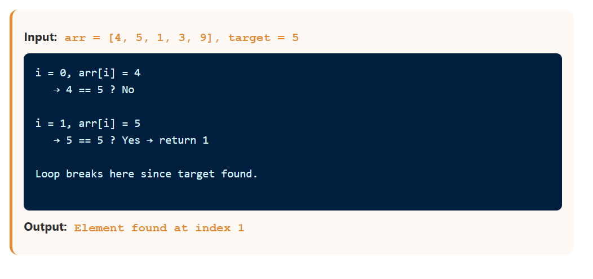
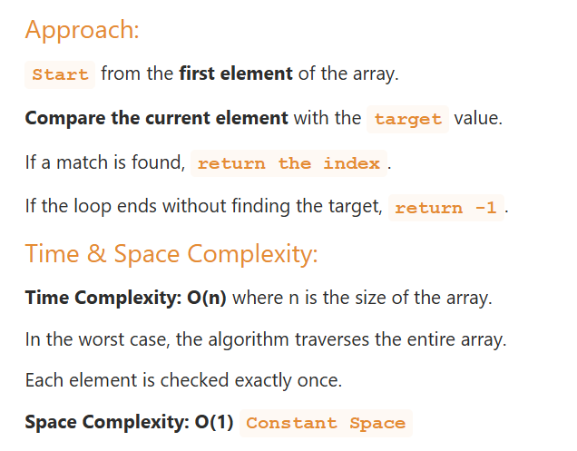

## Linear Search

### Concept
Check **each element one by one** until found or end of array.

Linear Search is a simple search algorithm used to find a specific element in an array. It checks each element of the array one by one until the target value is found or the end of the array is reached.

### Implementation

```js
// Basic Linear Search
function linearSearch(arr, target) {
  for (let i = 0; i < arr.length; i++) {
    if (arr[i] === target) return i; // Return index
  }
  return -1; // Not found
}

// Find all occurrences
function linearSearchAll(arr, target) {
  const indices = [];
  for (let i = 0; i < arr.length; i++) {
    if (arr[i] === target) indices.push(i);
  }
  return indices;
}

// Linear Search with predicate
function linearSearchBy(arr, predicate) {
  for (let i = 0; i < arr.length; i++) {
    if (predicate(arr[i])) return i;
  }
  return -1;
}

// Sentinel Linear Search — avoids checking boundary each iteration
function sentinelSearch(arr, target) {
  const n = arr.length;
  const last = arr[n - 1];
  arr[n - 1] = target; // Set sentinel

  let i = 0;
  while (arr[i] !== target) i++;

  arr[n - 1] = last; // Restore
  if (i < n - 1 || last === target) return i;
  return -1;
}

console.log(linearSearch([5, 3, 8, 1, 2], 8));  // 2
console.log(linearSearch([5, 3, 8, 1, 2], 99)); // -1
```
### Dry Run


### Complexity

| Case | Time | Space |
|---|---|---|
| Best | O(1) | O(1) |
| Average | O(n) | O(1) |
| Worst | O(n) | O(1) |



**When to use:** Unsorted arrays, small arrays, single search on unsorted data.