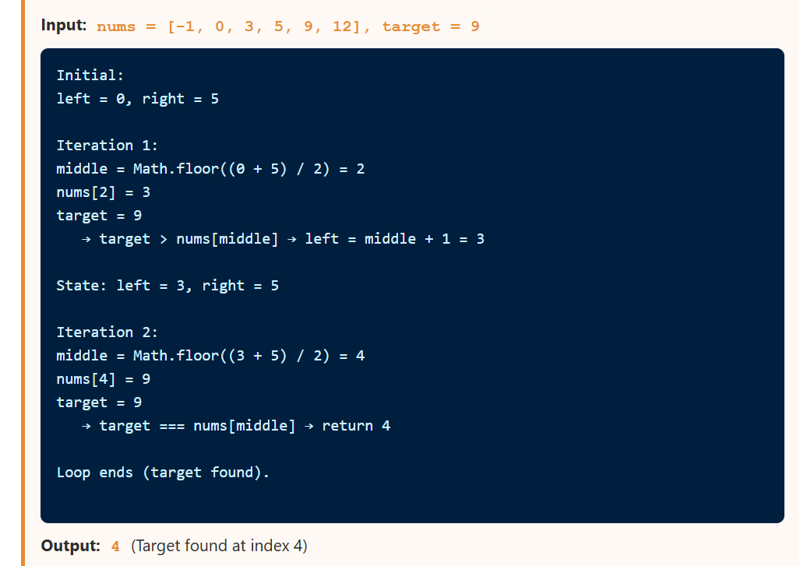
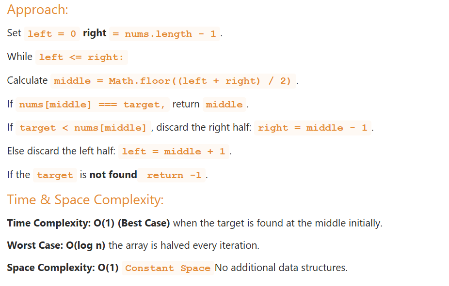

## Binary Search

### Concept
Works on **sorted arrays**. Divides the search space in half at each step by comparing the target with the middle element.

Binary Search is an efficient algorithm used to find the **position of a target value** within a **sorted array**. Unlike linear search, it repeatedly divides the search interval in half, significantly **reducing the number** of comparisons.

### Visualization
```
arr = [1, 2, 3, 5, 8, 13, 21], target = 8

left=0, right=6, mid=3 → arr[3]=5 < 8 → search right half
left=4, right=6, mid=5 → arr[5]=13 > 8 → search left half
left=4, right=4, mid=4 → arr[4]=8 = 8 → FOUND at index 4
```

### Implementation

```js
// Iterative Binary Search — preferred (no stack overflow risk)
function binarySearch(arr, target) {
  let left = 0;
  let right = arr.length - 1;

  while (left <= right) {
    const mid = Math.floor((left + right) / 2);
    // const mid = left + Math.floor((right - left) / 2); // Overflow-safe

    if (arr[mid] === target) return mid;      // Found
    if (arr[mid] < target)  left = mid + 1;  // Search right
    else                    right = mid - 1; // Search left
  }

  return -1; // Not found
}

// Recursive Binary Search
function binarySearchRecursive(arr, target, left = 0, right = arr.length - 1) {
  if (left > right) return -1; // Base case: not found

  const mid = Math.floor((left + right) / 2);

  if (arr[mid] === target) return mid;
  if (arr[mid] < target)  return binarySearchRecursive(arr, target, mid + 1, right);
  return binarySearchRecursive(arr, target, left, mid - 1);
}

// Binary Search returning insertion point (like Python's bisect)
function bisectLeft(arr, target) {
  let left = 0;
  let right = arr.length;

  while (left < right) {
    const mid = Math.floor((left + right) / 2);
    if (arr[mid] < target) left = mid + 1;
    else right = mid;
  }
  return left; // Leftmost insertion position
}

function bisectRight(arr, target) {
  let left = 0;
  let right = arr.length;

  while (left < right) {
    const mid = Math.floor((left + right) / 2);
    if (arr[mid] <= target) left = mid + 1;
    else right = mid;
  }
  return left; // Rightmost insertion position
}

const arr = [1, 2, 3, 5, 8, 13, 21];
console.log(binarySearch(arr, 8));  // 4
console.log(binarySearch(arr, 99)); // -1
console.log(bisectLeft([1,2,3,3,3,5], 3));  // 2
console.log(bisectRight([1,2,3,3,3,5], 3)); // 5
```

### Dry Run



### Complexity

| Case | Time | Space (iterative) |
|---|---|---|
| Best | O(1) | O(1) |
| Average | O(log n) | O(1) |
| Worst | O(log n) | O(1) |



**When to use:** Any sorted array search problem. Very commonly tested in interviews.

---

## Binary Search Variants

These are the most important patterns for interviews:

```js
// ── VARIANT 1: Find First Occurrence ──────────────────────
function findFirst(arr, target) {
  let left = 0, right = arr.length - 1;
  let result = -1;

  while (left <= right) {
    const mid = Math.floor((left + right) / 2);
    if (arr[mid] === target) {
      result = mid;
      right = mid - 1; // Keep searching LEFT for earlier occurrence
    } else if (arr[mid] < target) left = mid + 1;
    else right = mid - 1;
  }
  return result;
}

// ── VARIANT 2: Find Last Occurrence ───────────────────────
function findLast(arr, target) {
  let left = 0, right = arr.length - 1;
  let result = -1;

  while (left <= right) {
    const mid = Math.floor((left + right) / 2);
    if (arr[mid] === target) {
      result = mid;
      left = mid + 1; // Keep searching RIGHT for later occurrence
    } else if (arr[mid] < target) left = mid + 1;
    else right = mid - 1;
  }
  return result;
}

// ── VARIANT 3: Count occurrences of target ─────────────────
function countOccurrences(arr, target) {
  const first = findFirst(arr, target);
  if (first === -1) return 0;
  return findLast(arr, target) - first + 1;
}

// ── VARIANT 4: Find floor (largest element ≤ target) ──────
function floor(arr, target) {
  let left = 0, right = arr.length - 1;
  let result = -1;

  while (left <= right) {
    const mid = Math.floor((left + right) / 2);
    if (arr[mid] <= target) {
      result = arr[mid];
      left = mid + 1;
    } else right = mid - 1;
  }
  return result;
}

// ── VARIANT 5: Find ceil (smallest element ≥ target) ──────
function ceil(arr, target) {
  let left = 0, right = arr.length - 1;
  let result = -1;

  while (left <= right) {
    const mid = Math.floor((left + right) / 2);
    if (arr[mid] >= target) {
      result = arr[mid];
      right = mid - 1;
    } else left = mid + 1;
  }
  return result;
}

// ── VARIANT 6: Search in Rotated Sorted Array ─────────────
function searchRotated(arr, target) {
  let left = 0, right = arr.length - 1;

  while (left <= right) {
    const mid = Math.floor((left + right) / 2);

    if (arr[mid] === target) return mid;

    // Check which half is sorted
    if (arr[left] <= arr[mid]) { // Left half is sorted
      if (target >= arr[left] && target < arr[mid]) right = mid - 1;
      else left = mid + 1;
    } else { // Right half is sorted
      if (target > arr[mid] && target <= arr[right]) left = mid + 1;
      else right = mid - 1;
    }
  }
  return -1;
}

// ── VARIANT 7: Find Peak Element ──────────────────────────
function findPeak(arr) {
  let left = 0, right = arr.length - 1;

  while (left < right) {
    const mid = Math.floor((left + right) / 2);
    if (arr[mid] < arr[mid + 1]) left = mid + 1;  // Peak is on the right
    else right = mid;                               // Peak is on the left (or mid)
  }
  return left; // Index of peak
}

// ── VARIANT 8: Find minimum in rotated sorted array ───────
function findMinRotated(arr) {
  let left = 0, right = arr.length - 1;

  while (left < right) {
    const mid = Math.floor((left + right) / 2);
    if (arr[mid] > arr[right]) left = mid + 1; // Min is in right half
    else right = mid;                           // Min is in left half (or mid)
  }
  return arr[left];
}

// ── VARIANT 9: Binary Search on Answer ────────────────────
// Find smallest x such that f(x) is true (f is monotone)
function binarySearchOnAnswer(lo, hi, isValid) {
  while (lo < hi) {
    const mid = Math.floor((lo + hi) / 2);
    if (isValid(mid)) hi = mid;  // mid works, try smaller
    else lo = mid + 1;           // mid doesn't work, try larger
  }
  return lo;
}

// Example: Minimum days to make m bouquets
function minDays(bloomDay, m, k) {
  const canMake = (days) => {
    let bouquets = 0, flowers = 0;
    for (const d of bloomDay) {
      if (d <= days) { flowers++; if (flowers === k) { bouquets++; flowers = 0; } }
      else flowers = 0;
    }
    return bouquets >= m;
  };

  return binarySearchOnAnswer(1, Math.max(...bloomDay), canMake);
}

// ── VARIANT 10: Square Root using Binary Search ────────────
function sqrtBinary(n) {
  if (n < 2) return n;
  let left = 1, right = Math.floor(n / 2);
  let result = 0;

  while (left <= right) {
    const mid = Math.floor((left + right) / 2);
    if (mid * mid <= n) { result = mid; left = mid + 1; }
    else right = mid - 1;
  }
  return result;
}

const sorted = [1, 2, 2, 2, 3, 4, 5];
console.log(findFirst(sorted, 2));       // 1
console.log(findLast(sorted, 2));        // 3
console.log(countOccurrences(sorted, 2)); // 3
console.log(searchRotated([4,5,6,7,0,1,2], 0)); // 4
console.log(findPeak([1,2,3,1]));        // 2
console.log(sqrtBinary(16));             // 4
```

---
